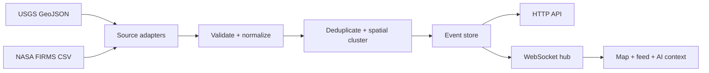
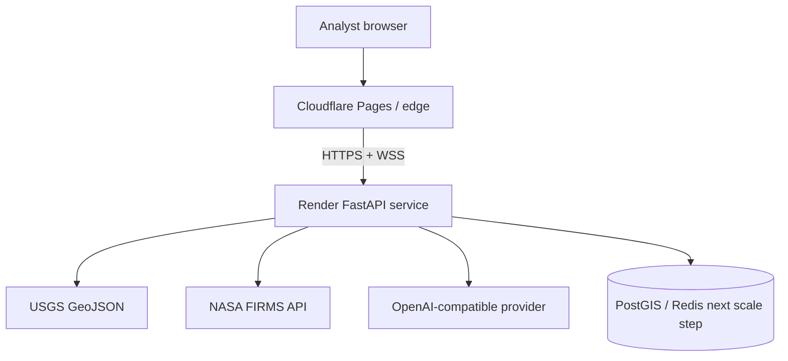

# World Pulse
## AI-powered global situation room
V0.3–V0.4 architecture

---

# The product thesis
## Turn global noise into an answerable operating picture

World Pulse is a calm, intelligent command center for understanding what is moving around the world.

- One geospatial view across hazards and signals
- Live updates without manual refresh
- Pulse AI answers grounded in the current event view
- Designed to move from demo feed to trusted source network

> See what is happening. Understand why it matters. Decide what to watch next.

---

# Situation-room experience
## One screen, three levels of clarity

1. **Overview** — active signals, critical-now count, coverage, and freshest event
2. **Map** — spatial distribution, severity, and top-signal context
3. **Ask** — guided and free-form Pulse AI questions about the current view

The interface is deliberately information-dense but visually quiet: dark surfaces, cyan live-state cues, clear severity colors, and prioritized language.

---

# V0.3 source layer
## From demo markers to real event intelligence

| Source | Signal | Ingestion method | Normalized output |
| --- | --- | --- | --- |
| USGS Earthquake Hazards Program | Earthquakes | Real-time GeoJSON feed | Magnitude, place, depth, time, source URL |
| NASA FIRMS | Active fire detections | MAP_KEY-protected CSV area endpoint | Fire cluster, detection count, FRP, confidence, satellite |
| Future sources | Floods, storms, volcanoes | Adapter contract | Same event schema, source-specific metadata |

USGS is polled through the real-time `all_hour.geojson` feed. NASA FIRMS detections are spatially clustered before entering the UI so tens of thousands of raw hotspots do not become tens of thousands of visual events.

---

# Normalization pipeline
## Every source becomes one event contract



The normalized event preserves source identity, timestamp, location, severity, source URL, and source-specific metadata. This keeps future ingestion adapters independent from the product UI.

---

# V0.4 live event engine
## A small supervisor, clear boundaries

- Independent USGS and FIRMS pollers run on configurable intervals
- Each source can fail without stopping the other source
- Changes are emitted as `event.upsert`, `event.remove`, `snapshot.updated`, `source.error`, and `heartbeat`
- The first deployment uses one Render API instance with an in-process store and hub
- Horizontal scale moves fan-out to Redis Streams or Pub/Sub and persistence to PostGIS

The engine is lifecycle-managed by FastAPI startup and shutdown hooks, so background work is started and stopped with the service rather than hidden in a shell process.

---

# WebSocket delivery
## The map should feel alive, not repeatedly refreshed

```text
Browser opens /ws/events
        ↓
Initial normalized snapshot
        ↓
USGS / FIRMS poll completes
        ↓
EventStore computes changes
        ↓
Hub broadcasts typed event messages
        ↓
Map, signal panel, and feed update in place
```

The frontend keeps HTTP for filtered reads and AI requests while the WebSocket carries event-state changes. This separation makes filtering predictable and live delivery low-latency.

---

# Pulse AI
## Answers grounded in the active operating picture

Pulse AI receives the current event view, not an unrestricted global prompt.

- **Guided prompts:** What needs attention? What is critical? Which regions are most active?
- **Grounding:** event title, location, severity, timestamp, source, and metadata
- **Safety behavior:** uncertainty is stated; missing casualty or impact data is not invented
- **Resilience:** optional OpenAI-compatible provider with a deterministic local fallback
- **Future intelligence:** summaries, deduplication, classification, source comparison, and alert explanations

> The AI is a decision-support layer over verified event records, not a replacement for source agencies or local authorities.

---

# Deployment topology
## Cloudflare at the edge, Render as the live intelligence service



Required configuration is server-side for provider secrets: `FIRMS_MAP_KEY`, `OPENAI_API_KEY`, `OPENAI_MODEL`, `ALLOWED_ORIGINS`, and `INGESTION_INTERVAL_SECONDS`. The browser only receives normalized public events and AI answers.

---

# Reliability and trust model
## Live does not mean unquestioned

| Concern | First implementation | Production evolution |
| --- | --- | --- |
| Source outage | Per-source error message and last store state | Circuit breakers and alerting |
| Duplicate events | Stable source-prefixed IDs | Durable reconciliation and merge rules |
| FIRMS volume | Coarse spatial clustering | Region-aware tiles and aggregate layers |
| WebSocket disconnect | Client reconnect on next page load | Exponential reconnect and replay cursor |
| Multi-instance scale | One Render process | Redis fan-out + PostGIS event history |
| AI hallucination risk | Source-grounded prompt + fallback | Retrieval, citations, evaluation suite |

The architecture favors transparent degradation: stale-but-labeled data is better than silent failure.

---

# Roadmap
## From foundation to trusted global intelligence

**Now — V0.3/V0.4:** USGS and NASA FIRMS adapters, normalized event model, fire clustering, live ingestion supervisor, WebSocket updates.

**Next — V0.5/V0.6:** flight and vessel layers, durable PostGIS storage, Redis fan-out, replay cursors, region subscriptions.

**Then — V0.7/V0.8:** weather and alerting, source confidence, AI summaries, classification, deduplication, and explainable prioritization.

**Production — V1.0:** accounts, saved locations, notification policies, observability, audit history, and data-quality operations.

---

# Closing
## A clearer operating picture for a changing world

World Pulse brings together live geospatial signals, resilient ingestion, real-time delivery, and grounded AI in one professional situation room.

**World Pulse**

Global event intelligence for the moments that matter.

### References

[1] [USGS Real-time Notifications, Feeds, and Web Services](https://earthquake.usgs.gov/earthquakes/feed/)

[2] [USGS Earthquake Catalog API Documentation](https://earthquake.usgs.gov/fdsnws/event/1/)

[3] [NASA FIRMS API](https://firms.modaps.eosdis.nasa.gov/api/)

[4] [NASA FIRMS API Tutorial](https://firms.modaps.eosdis.nasa.gov/content/academy/data_api/firms_api_use.html)
